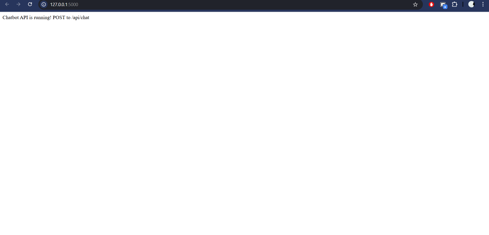
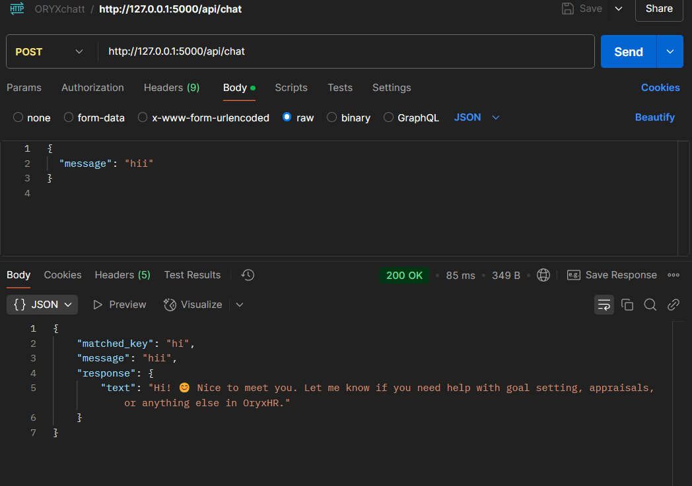
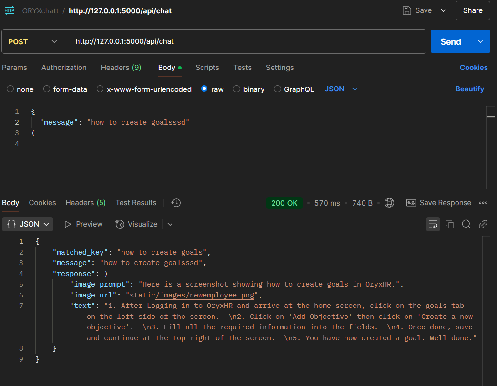

# Chatbox_ORYXHR
A). Project structure should look like this:-
```
/chatbot-oryxhr/
│
├── Dockerfile
├── app_new11.py
├── requirements.txt
├── predefined_response.json
├── .env

```
B). Build the Docker image<BR>
Run this in the terminal<BR>
```
docker build -t flask-chatbot .
```
C). Run the Docker container<BR>
After building the image successfully, run<BR>
```
docker run -p 5000:5000 flask-chatbot
```
After Running, clicking on the link - http://127.0.0.1:5000/, it will show as :- <br>
<br><br>
Optional - Check if docker container is running:- <br>
```
docker ps
```
Optional - To Stop and Remove the Old Container :- <br>
```
docker stop chatbot_container
docker rm chatbot_container
```

D). Test API - using Postman <br>
1. Open Postman and make a POST request to:<br>
    ```
    http://127.0.0.1:5000/api/chat
    ```
2. Create a new request<br>
Click "New" > "HTTP Request" or just open a new tab.

3. Set request type to POST<br>
In the dropdown next to the URL bar, select POST.
4. Enter the URL
   ```
   http://127.0.0.1:5000/api/chat
6.  Set the headers
Go to the Headers tab and add:<br>

    | Key | Value |
    | --- | --- |
    | Content-Type | application/json |

7. Set the body<br>
Go to the Body tab<br>
Choose raw<br>
From the dropdown next to "Text", choose JSON<br>
Paste this JSON:<br>
    ```
    {
      "message": "hello"
    }
    ```

9. Send the request
Click Send
You should see a JSON response like: <br>
<br>
<br>

E). otherwise - Test API - using Curl <br>
From another terminal (open in your CMD) while running the main terminal, use curl:<BR>
first put in the same directory:-<br>
```
cd /d F:\chatbot-oryxhr
```
then:-
```
curl -X POST http://127.0.0.1:5000/api/chat \
     -H "Content-Type: application/json" \
     -d "{\"message\": \"hello\"}"
```

F). (OPTIONAL) Push the image to Docker Hub - this repo is already pushed in my dockerhub:
```
docker tag flask-chatbot yourusername/flask-chatbot
docker push yourusername/flask-chatbot

```
Users can easily Pull the image:-<br>
```
docker pull yourusername/flask-chatbot
docker run -d -p 5000:5000 --name chatbot_container yourusername/flask-chatbot
```
